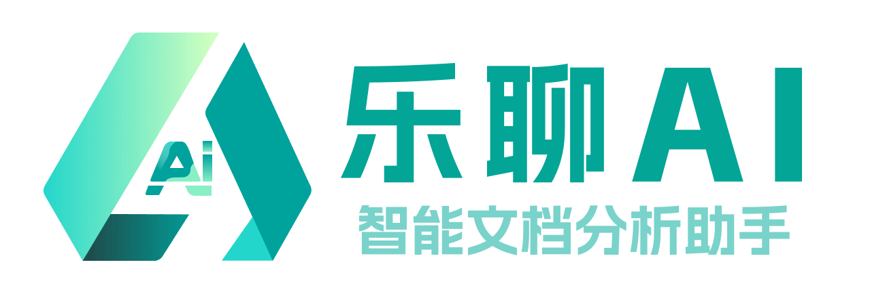
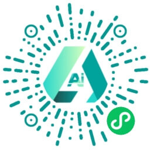
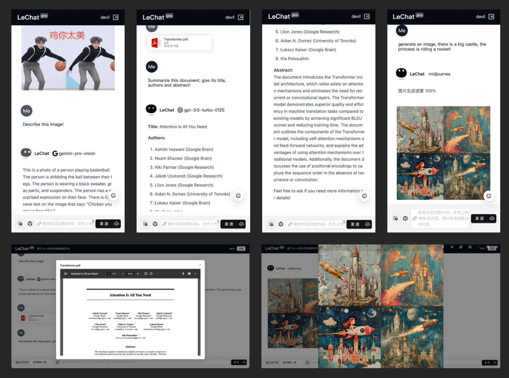

<!-- @format -->

<p align="center"></p>
<h1 align="center">UniAI</h1>
<h3 align="center">To Unify AI Models!</h3>

<p>
UniAI is a library integrated with multiple cutting-edge generative-AI models.
It provides a unified interface for different models, streamlining the development process by ensuring a consistent model input and output.
</p>

<h3 align=center>Chat</h3>


<h3 align=center>Imagine</h3>

<table>
    <tr>
        <td colspan="3"><strong>Prompt:</strong> Pink dress, Candy, Sandy, Mandy, short hair, blonde hair, bangs, forehead, red lipstick, elbow gloves, hair accessories, high heels, sitting, cross legged, high chair, cocktail, holding cocktail glass, looking through the glass.</td>
    </tr>
    <tr>
        <td colspan="3"><strong>Negative Prompt:</strong> EasyNegative, badhandv4, badv5, aid210, aid291.</td>
    </tr>
    <tr>
        <td width="33.3%"><strong>MidJourney</strong></td>
        <td width="33.3%"><strong>Stability v1.6</strong></td>
        <td width="33.3%"><strong>OpenAI DALL-E-3</strong></td>
    </tr>
    <tr>
        <td width="33.3%"></td>
        <td width="33.3%"></td>
        <td width="33.3%"></td>
    </tr>
</table>

<h3 align=center>Easy to Use</h3>

```typescript
import UniAI from 'uniai'
// fill the config for the provider/model you want to use!
const ai = new UniAI({ OpenAI: { key: 'Your key', proxy: 'Your proxy API' } })
// chat model
const chat = await ai.chat('hello world')
// embedding model
const embedding = await ai.embedding('hello world')
// imagine model
const task = await ai.imagine('a panda is eating bamboo')
// show imagining tasks, get generated images
const image = await ai.task(task.taskId)
// change image, Midjourney only, return a new task
const task2 = await ai.change('midjourney', task.taskId, 'UPSCALE', 4)
```

English · [🇨🇳 中文说明](./README_CN.md)

## Supported Models

<p>


</p>

Latest update: we have supported **OpenAI's O1** and **DeepSeek** models!

- [DeepSeek](https://api-docs.deepseek.com/)
- [OpenAI/GPT](https://platform.openai.com)
- [Google/Gemini](https://makersuite.google.com/app/)
- [IFLYTEK/Spark](https://xinghuo.xfyun.cn)
- [THUDM/ChatGLM](https://github.com/THUDM/ChatGLM4)
- [ZHIPU/GLM3-4](https://open.bigmodel.cn)
- [MoonShot](https://platform.moonshot.cn/docs)
- [AliYun/QianWen](https://help.aliyun.com/zh/model-studio)
- [Baidu/WenXin Workshop](https://cloud.baidu.com/product/wenxinworkshop)
- [OpenAI/DALL-E](https://platform.openai.com)
- [X AI Grok](https://docs.x.ai/docs/overview)
- [MidJourney Proxy](https://github.com/novicezk/midjourney-proxy)
- [Stability AI](https://platform.stability.ai/docs/getting-started)

## Applications Developed on UniAI

We have developed several sample applications using **uniai**:

<div align=center>



<br>

</div>

## Install

**Using yarn:**

```bash
yarn add uniai
```

**Using npm:**

```bash
npm install uniai --save
```

## Example

We have written some simple call demos for you, which is placed in the [examples](./example/) folder. You can read the example files directly to learn how to use **UniAI**.

You can also read on to learn how to use **UniAI** based on this documentation.

You can set up environment variables by referring to the [dotenv example](./.env.example)

### List Models

You can use `.models` to list all the available models in UniAI.

**TypeScript & JavaScript ES6+**

```typescript
import UniAI from 'uniai'

const ai = new UniAI()
console.log(ai.models)
```

**JavaScript ES5**

```javascript
const UniAI = require('uniai').default

const ai = new UniAI()
console.log(ai.models)
```

**Output**

```json
[
    {
        "provider": "OpenAI",
        "value": "openai",
        "models": ["gpt-3.5-turbo", "gpt-4o", "chatgpt-4o-latest", "gpt-4o-mini", "gpt-4-turbo", "gpt-4"]
    }
    // ...other providers and models
]
```

### Chat

To interact with a model, use `.chat()` and remember to provide the **required API key** or **secret** parameters when initializing `new UniAI()`.

Default model is **OpenAI/gpt-4o**, put the _OpenAI key_ and your _proxy API_.

```typescript
const key: string | string[] = 'Your OpenAI Key (required), support multi keys'
const proxy = 'Your OpenAI API proxy (optional)'
const uni = new UniAI({ OpenAI: { key, proxy } })
const res = await uni.chat()
console.log(res)
```

**Output**

```json
{
    "content": "I am OpenAI's language model trained to assist with information.",
    "model": "gpt-3.5-turbo-0613",
    "object": "chat.completion",
    "promptTokens": 20,
    "completionTokens": 13,
    "totalTokens": 33
}
```

**Chat with image**

```js
const input = [
    {
        role: 'user',
        content: 'Describe the image',
        img: 'https://img2.baidu.com/it/u=2595743336,2138195985&fm=253&fmt=auto?w=801&h=800'
    }
]
// Warn: If you choose a non-image model, img attributes will be dropped!
const res = await ai.chat(input, { model: 'gpt-4o' })
console.log(res)
```

**Output**

```json
{
    "content": "The image shows a person taking a mirror selfie using a smartphone...",
    "model": "gpt-4-1106-vision-preview",
    "object": "chat.completion",
    "promptTokens": 450,
    "completionTokens": 141,
    "totalTokens": 591
}
```

### Streaming Chat

For streaming chat, the response is a JSON buffer.

The following is an example to chat with Google gemini-pro in stream mode.

```typescript
const key: string | string[] = 'Your Google Key (required), support multi keys'
const proxy = 'Your google api proxy (optional)'
const uni = new UniAI({ Google: { key, proxy } })
const res = await uni.chat(input, { stream: true, provider: ModelProvider.Google, model: GoogleChatModel.GEM_PRO })
const stream = res as Readable
let data = ''
stream.on('data', chunk => (data += JSON.parse(chunk.toString()).content))
stream.on('end', () => console.log(data))
```

**Output (Stream)**

```
Language model trained by Google, at your service.
```

## Running Tests

UniAI uses `jest` to run unit tests on all supported models.

```bash
yarn test
```

If you want to run unit tests for a specific model provider:

```bash
# OpenAI, Google, Baidu, IFlyTek, MoonShot, GLM, Other, Imagine...
yarn test OpenAI
```

## Thanks

[Institute of Intelligent Computing Technology, Suzhou, CAS](http://iict.ac.cn/)

## Contributors

[Youwei Huang](https://github.com/devilyouwei)

[Weilong Yu](https://github.com/mrkk1)

## Who is using it

|                        Project                         |                                          Brief introduction                                           |
| :----------------------------------------------------: | :---------------------------------------------------------------------------------------------------: |
| [UniAI MaaS](https://github.com/uni-openai/uniai-maas) | UniAI is a unified API platform designed to simplify interaction with a variety of complex AI models. |
|  [LeChat](https://github.com/CAS-IICT/lechat-uniapp)   |         Document analysis based on large language model, dialogue with WeChat Mini Programs.          |
|         [LeChat Pro](https://lechat.cas-ll.cn)         |             Full-platform client based on UniAI, multi-model streaming dialogue platform.             |

## Star History

[](https://star-history.com/#devilyouwei/UniAI&Timeline)

## License

[MIT](./LICENSE)
